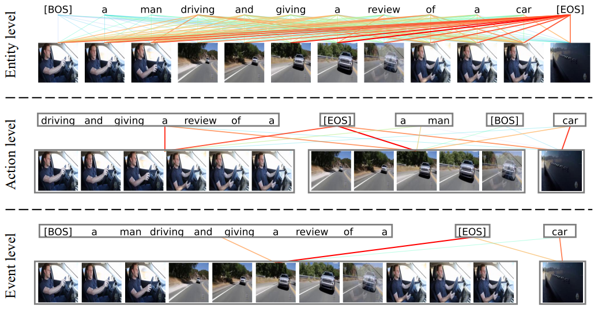
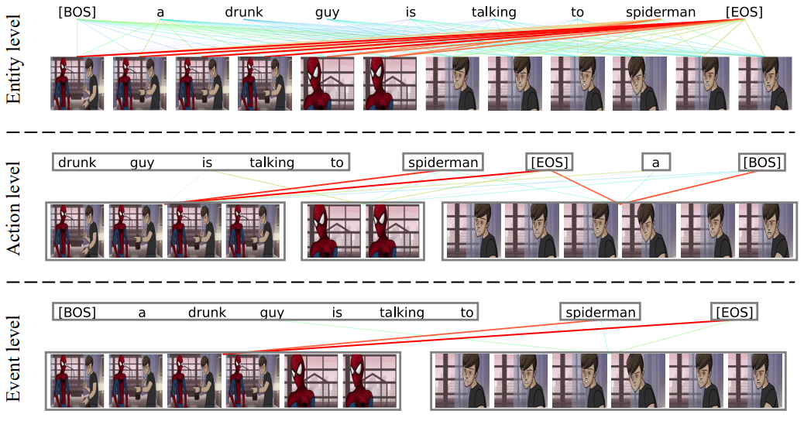
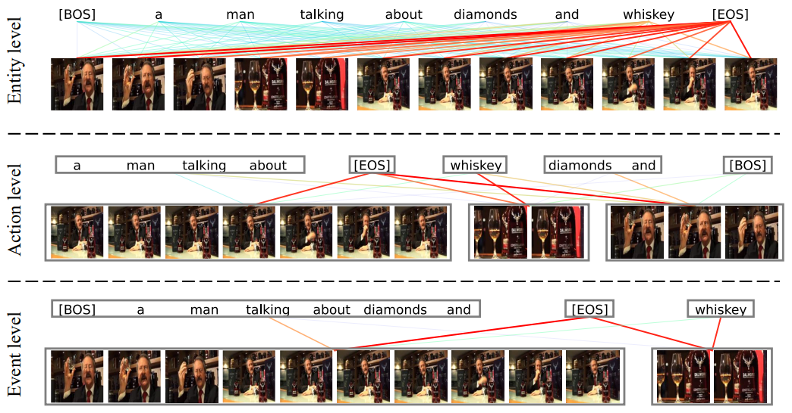
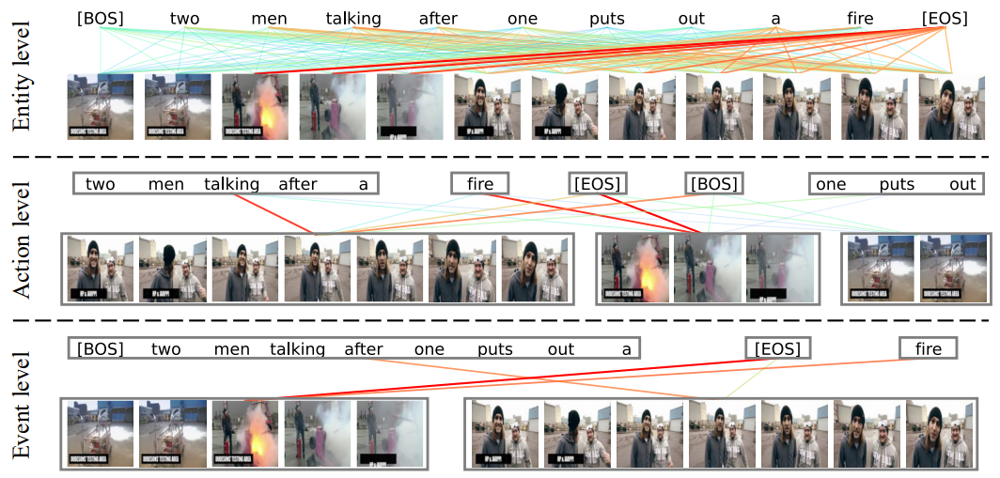

# HBI✨
The implementation of CVPR 2023 Highlight (Top 10%) paper [Video-Text as Game Players: Hierarchical Banzhaf Interaction for Cross-Modal Representation Learning]().

In this paper, we creatively model video-text as game players with multivariate cooperative game theory to wisely handle the uncertainty during fine-grained semantic interaction with diverse granularity, flexible combination, and vague intensity.

## Demo
https://user-images.githubusercontent.com/53246557/221760113-4a523e7e-d743-4dff-9f16-357ab0be0d5b.mp4


## Updates
* Feb 28 2023: We will release the code asap. No later than the end of May. (I am busy with other DDLs. After that, I will open the source code as soon as possible. Please understand.)


## Visualization

### Example 1
<div align=center>

</div>

<details>
<summary><b>More examples</b></summary>
  
### Example 2
<div align=center>

</div>

### Example 3
<div align=center>

</div>

### Example 4
<div align=center>

</div>

### Example 5
<div align=center>

</div>

### Example 6
<div align=center>

</div>

### Example 7
<div align=center>

</div>

</details>

## Quick Start
### Text-video Retrieval

### Video-question Answering

## Citation
If you find our code helpful in your work, please consider citing:
```
@inproceedings{jin2022video,
  title={Video-Text as Game Players: Hierarchical Banzhaf Interaction for Cross-Modal Representation Learning},
  author={Peng, Jin and JinFa, Huang and Pengfei, Xiong and Shangxuan, Tian and Chang, Liu and Xiangyang, Ji and Li, Yuan and Jie, Chen},
  booktitle={Proceedings of the IEEE/CVF Conference on Computer Vision and Pattern Recognition},
  year={2023}
}
```

## Acknowledgments
Our code is based on [EMCL](https://github.com/jpthu17/EMCL), [CLIP](https://github.com/openai/CLIP), [CLIP4Clip](https://github.com/ArrowLuo/CLIP4Clip/) and [DRL](https://github.com/foolwood/DRL). We sincerely appreciate for their contributions.
