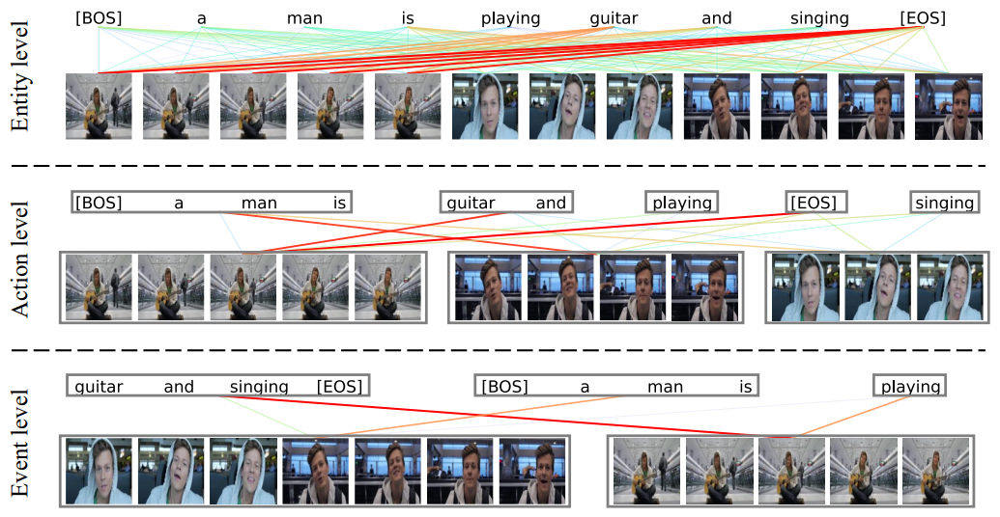
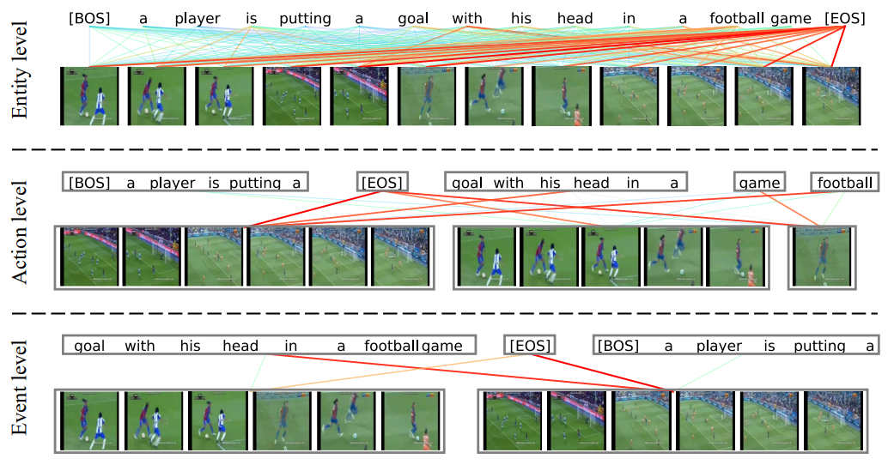
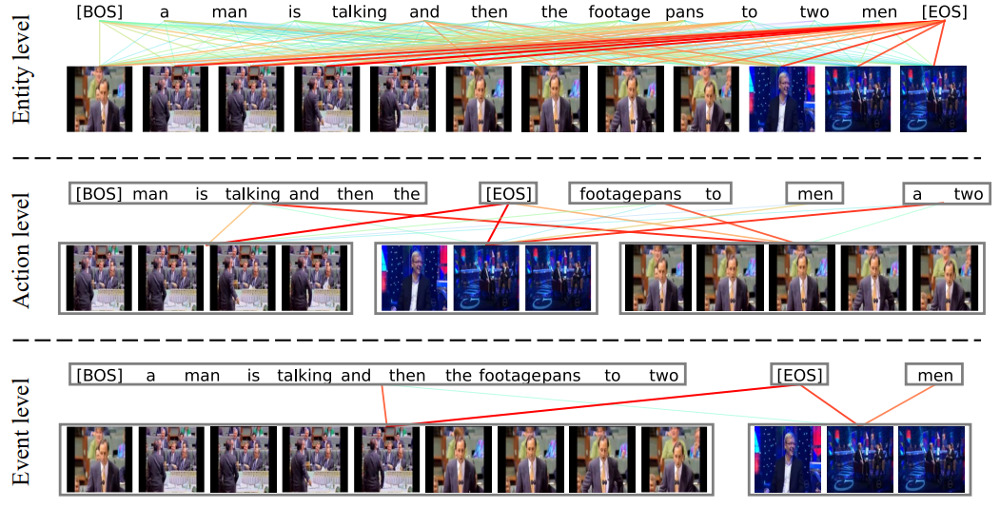

# HBI✨
The implementation of CVPR 2023 paper [Video-Text as Game Players: Hierarchical Banzhaf Interaction for Cross-Modal Representation Learning]().

In this paper, we creatively model video-text as game players with multivariate cooperative game theory to wisely handle the uncertainty during fine-grained semantic interaction with diverse granularity, flexible combination, and vague intensity.

### Demo
https://user-images.githubusercontent.com/53246557/221760113-4a523e7e-d743-4dff-9f16-357ab0be0d5b.mp4

****
### Updates
* Feb 28 2023: We will release the code asap. No later than the end of May. (I am busy with other DDLs. After that, I will open the source code as soon as possible. Please understand.)
****
### Visualization

#### Example 1

#### Example 2

#### Example 3

#### Example 4

#### Example 5

#### Example 6

#### Example 7

****
## Quick Start
### Text-video Retrieval

### Video-question Answering
****
## Citation
If you find our code helpful in your work, please consider citing:
****
## Acknowledgments
